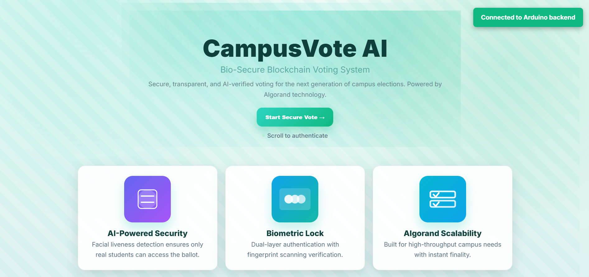
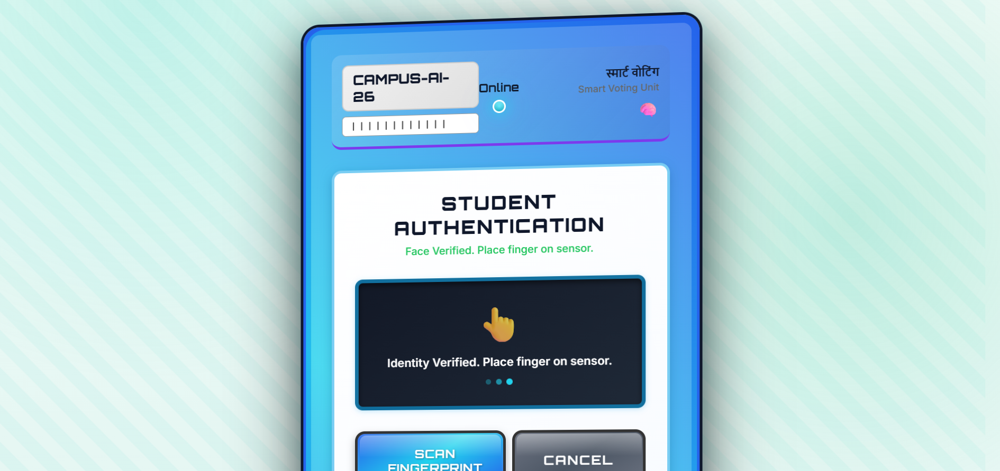

# 🗳️ CampusVote AI: Secure & Private Blockchain Voting

> **Hackspiration '26 Submission** | **Track:** Blockchain (Algorand)
>
> A privacy-preserving, professional-grade electronic voting system designed for university campuses. It combines **Biometric Hardware Security** with the **Algorand Blockchain** using a novel "Ephemeral Token" protocol to ensure true ballot secrecy.

---

## 🚀 Key Innovations

### 1. 🕵️‍♂️ True Privacy via Ephemeral Tokens
Unlike standard blockchain voting where a user's address is linked to their vote, our system uses a **Token Dispenser Model**:
*   **Authentication**: User proves identity via **Fingerprint Sensor** (off-chain).
*   **Authorization**: Backend checks eligibility and issues a **One-Time-Use Algorand Account** funded with **1 Vote Token** (or Algo).
*   **Voting**: The browser signs the vote with this temporary key. The blockchain sees `Temp_Account -> Candidate`, making the vote mathematically untraceable to the Student ID.

### 2. 🔄 Hardware Resilience (The "Hot-Swap" Protocol)
We solved the "Broken Sensor" problem common in hardware projects:
*   **Central Trust**: Fingerprint templates are stored *encrypted* in the central backend, not just on the sensor.
*   **Sync**: If Sensor A breaks, the Admin connects Sensor B and triggers a `sync_templates` command which restores all registered users to the new hardware instantly. No re-registration needed.

### 3. ⚡ High-Speed Algorand Finality
*   Built on **Algorand** for <4s finality and negligible transaction costs.
*   Uses **Algosdk** directly in the browser—no MetaMask or wallet plugins required for the voter.

---

## 🛠️ System Architecture

graph TD
    User((User)) -->|Fingerprint Scan| Sensor[R307/R305 Sensor]
    Sensor -->|Raw Template| Backend[Node.js Authority]
    Backend -->|Check Membership| DB[(Secure Database)]

    subgraph Privacy_Layer
        Backend -->|Issue Ephemeral Key| Frontend[Web Client]
        Frontend -->|Sign Vote Locally| Algorand[Algorand Network]
    end

    Algorand -->|Immutable Record| Ledger[(Blockchain)]


## � Technology Stack

*   **Blockchain**: Algorand (SDK v2), PyTeal Smart Contracts.
*   **Hardware**: Arduino/Serial Bridge, R307/R305 Optical Fingerprint Sensor.
*   **Backend**: Node.js, Express, WebSocket (Real-time hardware bridge).
*   **Frontend**: HTML5, CSS3 (Glassmorphism), Vanilla JS (No heavy frameworks).

---

## 🚀 Quick Start Guide

### Prerequisites
1.  **Node.js** (v16+)
2.  **Arduino/Fingerprint Sensor** (Optional - Simulation Mode available)

### 1. Configure Environment
Create a `.env` file in the root directory (or use the provided defaults):

```env
# Algorand Config (Testnet or Sandbox)
ALGOD_TOKEN=aaaaaaaaaaaaaaaaaaaaaaaaaaaaaaaaaaaaaaaaaaaaaaaaaaaaaaaaaaaaaaaa
ALGOD_SERVER=http://localhost
ALGOD_PORT=4001

# Admin Account (Must have Algos to fund voters)
ADMIN_MNEMONIC=your 25 word mnemonic phrase goes here
```

### 2. Install Dependencies
```bash
# Install root/backend dependencies
npm install

# Install backend specific (if not recursive)
cd backend && npm install && cd ..
```

### 3. Run the System
We provide a one-click startup script:

```powershell
# Windows
.\run_hackathon.bat
```

*   **Frontend**: http://localhost:8080
*   **Backend**: http://localhost:3001

---

## 🧪 How to Demo (Judge's Guide)

### With Hardware (Fingerprint Sensor)
1.  Connect the R305/R307 sensor via USB-TTL.
2.  Run the backend. It will auto-detect the COM port.
3.  Go to **Frontend**. Click **"Scan Fingerprint"**.
4.  Place finger on sensor.
5.  **Backend** verifies -> **Frontend** receives "Ephemeral Key".
6.  User selects candidate -> Signs Vote -> **Blockchain Confirmed**.

---

## 📂 Project Structure

*   `/frontend`: The Voter Interface (Voting, Dashboard, Receipt).
    *   `js/algorand-manager.js`: Handles `algosdk` interactions.
    *   `js/auth.js`: WebSocket bridge to Arduino.
*   `/backend`: The Central Authority & Hardware Bridge.
    *   `server.js`: Concept of Operations (Identity -> Ephemeral Key).
*   `/algorand`: Smart Contracts (PyTeal).

---

## �️ Security & Privacy Checklist
*   [x] **No Raw Biometrics**: Only encrypted templates stored.
*   [x] **Linkability Broken**: Admin sees "User Voted", Blockchain sees "Anonymous Key Voted".
*   [x] **Double Voting**: Prevented by Backend State + Blockchain Nullifiers.
*   [x] **Replay Attacks**: Nonce-based backend authentication.

---


---

## 📸 Screenshots







---

**Team Metaminds** 
